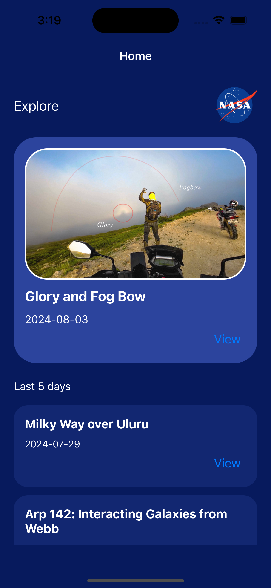
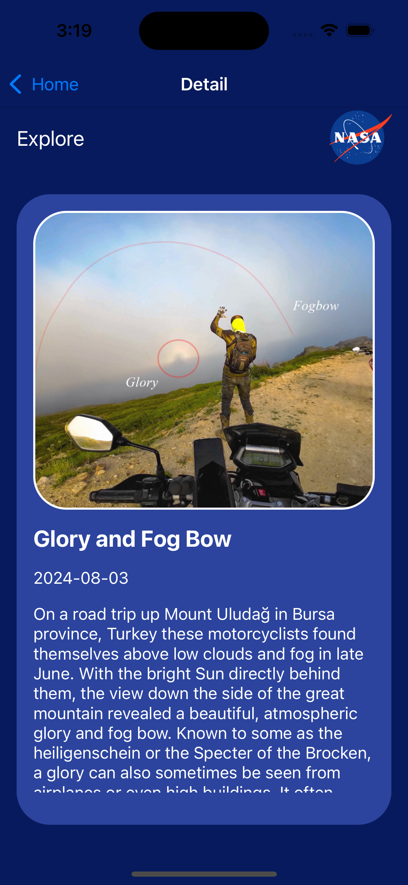
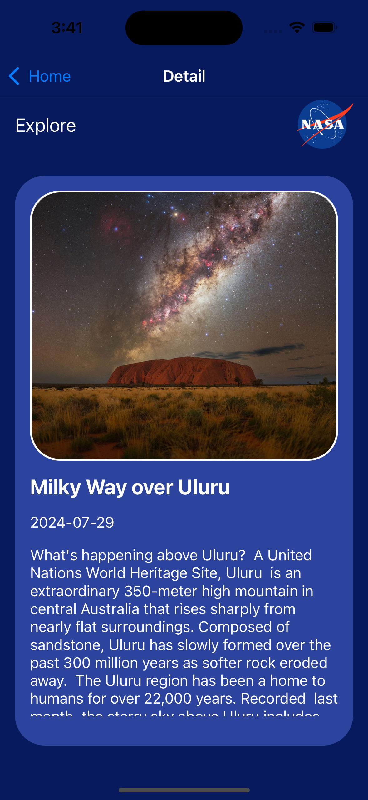
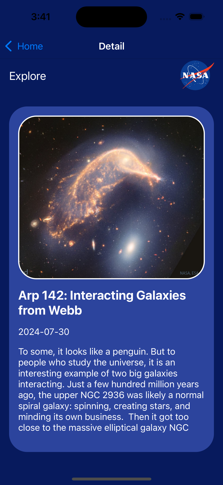

# NASA-News-App
<h1 align="center">
	
</h1>

<h3 align="center">
  App with recent news from NASA !
</h3>

<p align="center"></p>

<p align="center">
  

  

  

  

  
</p>

<p align="center">
  <a href="#-about-the-project">About The Project</a>&nbsp;&nbsp;&nbsp;|&nbsp;&nbsp;&nbsp;
  <a href="#-technologies">Technologies</a>&nbsp;&nbsp;&nbsp;|&nbsp;&nbsp;&nbsp;
  <a href="#-getting-started">Getting Started</a>&nbsp;&nbsp;&nbsp;|&nbsp;&nbsp;&nbsp;
  <a href="#contact">Contact</a>&nbsp;&nbsp;&nbsp;|&nbsp;&nbsp;&nbsp;
  <a href="#-license">License</a>
</p>

## 👨🏻‍💻 About the project

<p>
This is a mobile app created with react native in expo, it is an app that consumes an API which obtains the information on the most recent news from NASA, it has a main screen that shows the most important news and at the bottom a container with more news.

By clicking on see more you can access a new screen where you will see the news with more detail and information.

This is created through components and hooks to make the code a little more reusable and optimal.

</p>

## 🚀 Technologies

Main technologies that I used to develop this frontend app

- [Expo](https://docs.expo.io)
- [ReactJS](https://nodejs.org/en)
- [TypeScript](https://www.typescriptlang.org)
- [React-Native](https://reactnative.dev/docs/getting-started)
- [VS Code](https://code.visualstudio.com) 

## 💻 Getting started

### Requirements

- [Node.js](https://nodejs.org/en/)
- [Yarn](https://classic.yarnpkg.com/) or [npm](https://www.npmjs.com/)

**1. Clone the project**
```bash
git clone https://github.com/Alfred-developer/NASA-News-App.git
```


**2. Access the folder**
```bash
cd nasa-news-app
```

### Follow the steps below

**3. Install the dependencies**
```bash
npm i
```
**4. Run the web app**
```bash
npx expo start
```

## Screenshots
<div>
	
	
	
	
</div>

<!-- LICENSE -->
## License

Distributed under the MIT License. See LICENSE for more information.

## Contact

Alfred-developer - anavarrolga@gmail.com


Project Link https://github.com/Alfred-developer/NASA-News-App 


